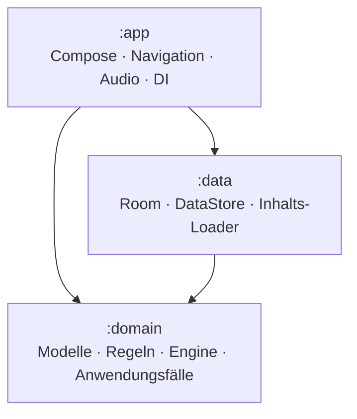
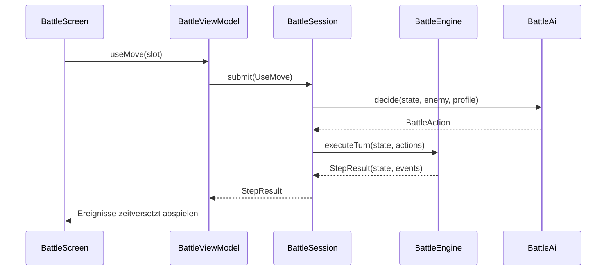
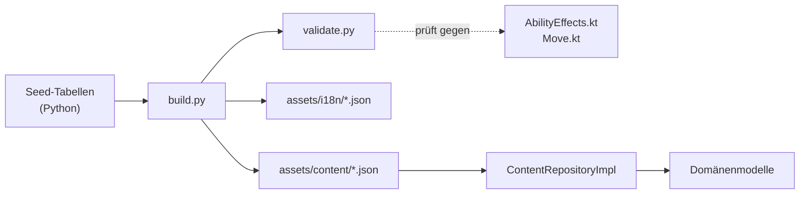

# Architektur

## Überblick

Runeveil folgt Clean Architecture in drei Gradle-Modulen. Die Abhängigkeiten
zeigen ausschließlich nach innen:

`:domain` ist ein reines Kotlin/JVM-Modul ohne Android-Abhängigkeit. Das ist
keine Stilfrage: die gesamte Spielmechanik lässt sich dadurch in Millisekunden
auf der JVM testen, ohne Emulator und ohne Robolectric.

## Schichten

### `:domain`

| Paket | Inhalt |
|---|---|
| `model.monster` | Element, Werte, Spezies, Instanz, Temperamente, Entwicklung |
| `model.battle` | Attacken, Effekte, Status, Wetter, Kampfzustand, Ereignisse |
| `model.world` | Regionen, Orte, Verbindungen, Begegnungstabellen, Läden |
| `model.story` | Quests, Dialoge, Kapitel, Zwischensequenzen, Enden |
| `model.item` | Gegenstände, Runenkugeln, Ausrüstung, Runen, Rezepte |
| `model.npc` | NPCs, Trainerteams, Fraktionen |
| `model.player` | Spielerprofil, Aussehen, Statistiken, Titel, Erfolge |
| `model.save` | Speicherstand und Slot-Übersicht |
| `rules` | Typentabelle, Werte-, Erfahrungs-, Schadens-, Treffer-, Fang-, Zucht-, Entwicklungs-, Begegnungs-, Inventar- und Questregeln |
| `battle` | Kampf-Engine, Gegner-KI, Fähigkeitseffekte |
| `usecase` | Anwendungsfälle, die mehrere Repositories verbinden |
| `repository` | Schnittstellen — Implementierungen liegen in `:data` |

### `:data`

Implementiert jede Schnittstelle aus `:domain`:

- **Inhalte** — `ContentRepositoryImpl` liest die JSON-Assets **parallel**,
  bildet sie auf Domänenmodelle ab und indiziert sie in Maps. Der Ladevorgang
  läuft genau einmal (Mutex), danach ist jeder Zugriff O(1).
- **Persistenz** — Room mit sieben Tabellen. Jede Tabelle ist nach `saveSlot`
  partitioniert; ein Speicherstand *ist* eine Partition, keine eigene Datei.
- **Einstellungen** — DataStore, bewusst außerhalb der Speicherstände: Lautstärke
  und Barrierefreiheit gehören zum Spieler, nicht zum Spielstand.
- **Texte** — `LocalizationRepository` löst Inhalts-Schlüssel aus
  `assets/i18n/<lang>.json` auf.

### `:app`

Compose-UI nach MVVM. Jeder Bildschirm besteht aus einer zustandslosen
`@Composable`-Funktion und einem `@HiltViewModel`, das einen
`StateFlow<UiState>` bereitstellt. ViewModels sprechen **nur** mit
Anwendungsfällen und Repositories, nie mit Room oder Assets.

## Warum Texte nicht in `strings.xml` liegen

Die Inhalte umfassen rund 4 500 generierte Zeichenketten (Monsternamen,
Attackenbeschreibungen, Questtexte). Als Android-Ressourcen würde jede
Inhaltsänderung einen vollständigen Neubau der App erzwingen und `R.string`
massiv aufblähen. Stattdessen:

- **UI-Bedienelemente** ("Speichern", "Abbrechen") → `res/values/strings.xml`
- **Spielinhalte** (Namen, Lore, Quests) → `assets/i18n/de.json`, `en.json`

Die Domänenmodelle tragen deshalb `nameKey`, nicht `name` — sie bleiben frei von
Darstellungsfragen. Die Composition stellt den Auflöser über
`LocalContentStrings` bereit; Bildschirme rufen `contentText("species_x_name")`.

## Kampf-Engine

`BattleEngine.executeTurn` ist eine **reine Funktion** aus Zustand, Aktionen und
`Rng`. Damit ist ein Kampf bei gleichem Seed exakt reproduzierbar — genau das
prüft der Test `the same seed always produces the same battle`. Praktische
Folgen: Kämpfe lassen sich mitten im Verlauf speichern, Fehlerberichte lassen
sich nachspielen, und ein neu geladener Spielstand kann keinen Wurf wiederholen.

### Rundenablauf

1. **Rundenbeginn** — Ereignis, Fähigkeiten mit Rundenstart-Auslöser.
2. **Reihenfolge** — Flucht und Gegenstände zuerst, dann Wechsel, dann Attacken
   nach Priorität und effektiver Initiative (Gleichstand per Münzwurf).
3. **Kombinationen** — Verbündete mit gleichem `comboTag` erhalten +25 % Schaden.
4. **Auflösung** — Status-Gate → AP → Trefferwurf → Schaden → Effekte.
5. **Rundenende** — Wetterschaden, Statusticks, Regeneration, Ablaufzähler.
6. **Auswertung** — K.-o.-Meldungen, Ausgang, Rundenzähler.

Alle Fähigkeiten sind in `AbilityEffects` als reine Funktionen umgesetzt; der
Inhalts-Validator lehnt jede Fähigkeit ab, deren `effectId` dort nicht existiert.
Es gibt bewusst keinen stillen Ausweichpfad.

## Inhalts-Pipeline

Der Generator erweitert kompakte, handgeschriebene Seed-Tabellen (Monsterfamilien,
Attacken-Archetypen, Regionen, Kapitel) zu vollständigen Inhalten. Das hält die
Datenmenge pflegbar und garantiert Konsistenz: Werte folgen dem Rollen- und
Stufenbudget, Lernlisten stammen aus dem tatsächlichen Attackenpool, jede
Referenz wird geprüft.

## Nebenläufigkeit

- Datenbank- und Parse-Arbeit läuft auf `@IoDispatcher`.
- Regelauswertung auf `@DefaultDispatcher`.
- `ActiveSlot` hält den aktiven Speicherplatz als `StateFlow`; Repositories
  verwenden `flatMapLatest`, sodass ein Slot-Wechsel automatisch alle Abfragen
  neu ausführt — ohne Cache-Invalidierung.

## Fehlerbehandlung

| Situation | Verhalten |
|---|---|
| Unbekannte Art in einem Spielstand | Zeile wird übersprungen, Rest des Teams lädt |
| Fehlender Textschlüssel | Schlüssel selbst wird angezeigt (sofort sichtbar) |
| Fehlende Audiodatei | stiller No-Op, Spiel bleibt spielbar |
| Ungültiger Enum-Wert im Inhalt | harter Fehler mit Klartextmeldung — Inhaltsfehler |
| Fehlende Room-Migration | harter Fehler; **kein** destruktiver Fallback |

Die letzte Zeile ist Absicht: ein verlorener Spielstand ist schlimmer als ein
Absturz im Entwicklungsbau.
