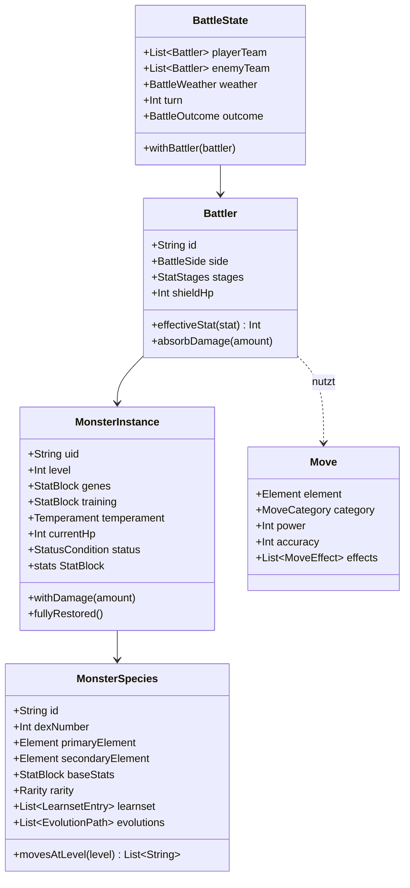

# Klassenübersicht

Die wichtigsten Typen je Schicht, mit ihrer Aufgabe in einem Satz. Vollständige
Beschreibungen stehen als KDoc am jeweiligen Typ.

## Domäne — Modelle

| Typ | Aufgabe |
|---|---|
| `Element` | Die 14 Affinitäten samt Glyphe und Farbe |
| `StatBlock` | Unveränderliche Sieben-Werte-Gruppe (Basis, Gene, Training) |
| `StatStages` | Kampfinterne Wertstufen −6…+6 plus Genauigkeit/Ausweichen |
| `MonsterSpecies` | Inhaltsdefinition einer Art |
| `MonsterInstance` | Ein konkretes, besessenes Wesen |
| `Move` / `MoveEffect` | Attacke und ihre 24 möglichen Mechaniken |
| `StatusCondition` | Die acht Statusveränderungen samt Wirkung |
| `BattleWeather` | Acht Wetter mit Schadens-, Treffer- und Tickwirkung |
| `Battler` / `BattleState` | Kampfteilnehmer und vollständiger Kampfzustand |
| `BattleAction` / `BattleEvent` | Eingabe an und Ausgabe aus der Engine |
| `Region` / `Location` | Weltgraph aus Knoten und Verbindungen |
| `Quest` / `QuestProgress` | Auftragsdefinition und laufender Fortschritt |
| `DialogueTree` | Verzweigtes Gespräch mit Bedingungen und Aktionen |
| `GameSave` / `SaveSlotSummary` | Spielstand und dessen Kopfzeile |

## Domäne — Regeln

| Objekt | Verantwortung |
|---|---|
| `TypeChart` | Effektivitätsmatrix, Schwächen, Resistenzen, Immunitäten |
| `StatCalculator` | Basis + Gene + Training + Temperament → Kampfwerte |
| `ExperienceCurve` | Erfahrungstabelle, Stufenauflösung, Kampfbelohnung |
| `DamageCalculator` | Schadensformel, Affinität, kritische Treffer |
| `AccuracyCalculator` | Trefferchance, Initiative, Fluchtchance |
| `CaptureCalculator` | Fangwert und Auflösung in vier Erschütterungen |
| `BreedingRules` | Kompatibilität, Genvererbung, Mutation, Ei-Erzeugung |
| `EvolutionRules` | Auswertung der Entwicklungsbedingungen |
| `EncounterRules` | Begegnungswurf, Tabellenauswahl, Wesenserzeugung |
| `ProgressionRules` | Erfahrung, Stufenaufstieg, Talente, Runen, Freundschaft |
| `InventoryRules` | Stapel, Preise, Handwerk |
| `QuestRules` | Ereignisabgleich, Freischaltbedingungen, Tagesreset |

## Domäne — Kampf und Anwendungsfälle

| Typ | Verantwortung |
|---|---|
| `BattleEngine` | Rundenpipeline; reine Funktion aus Zustand, Aktionen, Zufall |
| `BattleAi` | Aktionswahl mit fünf Profilen |
| `AbilityEffects` | Die 42 passiven Fähigkeiten als reine Funktionen |
| `BattleContent` | Schmale Inhaltsschnittstelle, die die Engine benötigt |
| `BattleSession` | Zustandsbehaftete Klammer um Engine + KI für die UI |
| `RollEncounterUseCase` | Ein Schritt in der Welt → eventuell ein Kampf |
| `RegisterCaptureUseCase` | Fang speichern, Bestiarium und Quests fortschreiben |
| `ApplyBattleResultsUseCase` | Erfahrung, Training, Freundschaft nach dem Kampf |
| `TrackQuestEventUseCase` | Weltereignis auf alle aktiven Quests anwenden |
| `BreedUseCase` / `AdvanceEggsUseCase` | Ei erzeugen und ausbrüten |
| `CraftUseCase` / `TradeUseCase` | Handwerk und Handel |
| `ResolveEndingUseCase` | Ende aus Flags, Moral und Runen bestimmen |

## Daten

| Typ | Verantwortung |
|---|---|
| `ContentRepositoryImpl` | Assets laden, abbilden, indizieren; auch `BattleContent` |
| `RuneveilDatabase` | Room-Datenbank mit sieben Tabellen |
| `MonsterRepositoryImpl` | Team und Gewölbe |
| `SaveRepositoryImpl` | Speicherstände, neues Spiel, New Game Plus |
| `LocalizationRepository` | Auflösung der Inhalts-Textschlüssel |
| `ActiveSlot` | Aktiver Speicherplatz als `StateFlow` |

## App

| Typ | Verantwortung |
|---|---|
| `RuneveilApplication` | Hilt-Graph, Audio an den Prozess-Lebenszyklus binden |
| `MainActivity` / `BootViewModel` | Splash halten, bis Inhalte geladen sind |
| `RuneveilNavHost` / `Destination` | 16 Ziele mit typsicheren Routen |
| `AudioEngine` | ExoPlayer für Musik, SoundPool für Effekte |
| `RuneveilTheme` | Farbschemata, Typografie, Bewegungseinstellungen |
| `BattleViewModel` | Kampfsteuerung und zeitversetztes Abspielen der Ereignisse |
