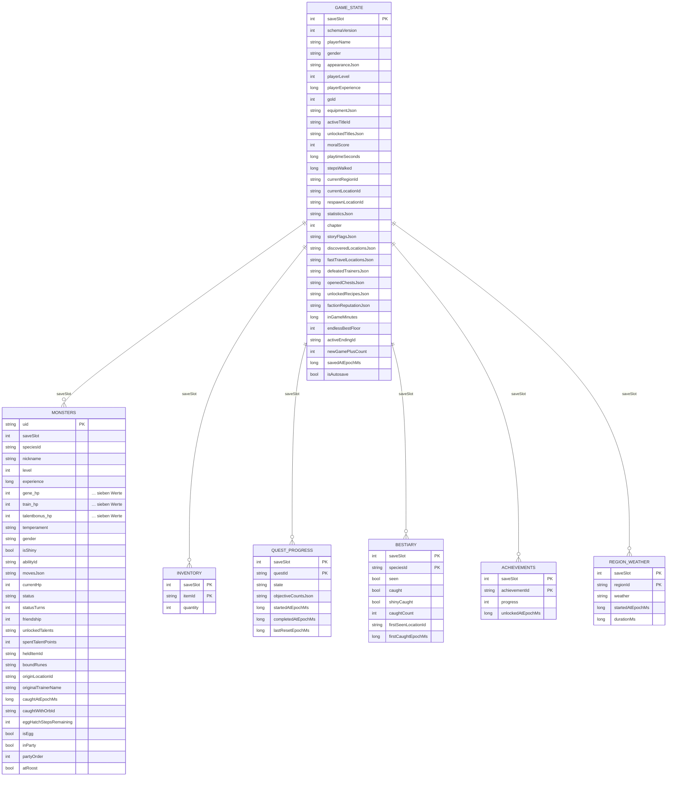

# Datenbankschema

Room, Version 1, Datei `runeveil.db`. Schema-Exporte liegen unter `data/schemas/`
und werden für Migrationstests verwendet.

## Grundprinzip

Jede Tabelle ist nach `saveSlot` partitioniert. Ein Spielstand ist damit eine
Partition, keine eigene Datei. Das macht Autosave billig: Monster, Inventar und
Questfortschritt sind bereits geschrieben, sobald sie sich ändern — gespeichert
wird nur noch die Kopfzeile.

Slot 0 ist der Autosave, Slots 1–3 sind manuell.

## Entwurfsentscheidungen

**Werte eingebettet, nicht als JSON.** Gene, Trainingswerte und Talentboni liegen
als `@Embedded`-Blöcke mit Spaltenpräfix vor (`gene_hp`, `train_attack` …). Das
Gewölbe sortiert nach Werten — das geht nur in SQL, wenn die Werte Spalten sind.

**Mengen als JSON-Arrays.** Story-Flags, entdeckte Orte, geöffnete Truhen werden
immer vollständig gelesen und geschrieben, nie einzeln abgefragt. Eine
Verknüpfungstabelle brächte hier nur Kosten.

**Team und Gewölbe in einer Tabelle.** Die Zugehörigkeit steckt in `inParty` und
`partyOrder`. Ein Umzug ist ein Spalten-Update statt Löschen + Einfügen; die
Zeilenidentität (und damit Fangdatum und Originaltrainer) bleibt erhalten.

**Kein destruktiver Migrations-Fallback.** `fallbackToDestructiveMigration()`
wird bewusst nicht gesetzt. Eine fehlende Migration soll im Entwicklungsbau laut
scheitern, statt im Feld einen Spielstand zu löschen.

## Migrationen

Beim Erhöhen von `RuneveilDatabase.VERSION`:

1. `Migration(n, n+1)` schreiben und in `CoreDataModule.provideDatabase` eintragen.
2. Schema-JSON aus `data/schemas/` committen.
3. Test mit `MigrationTestHelper` gegen das exportierte Schema ergänzen.

`GameSave.CURRENT_SCHEMA_VERSION` beschreibt davon unabhängig das *Format* des
Spielstands innerhalb einer Zeile und wird erhöht, wenn sich die Bedeutung von
Feldern ändert.
